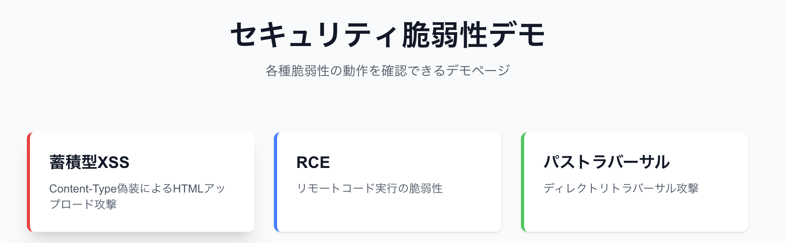
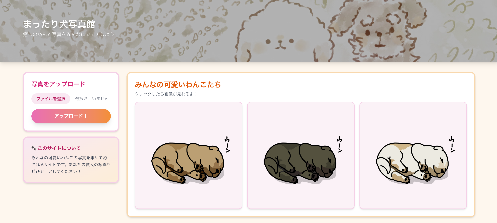
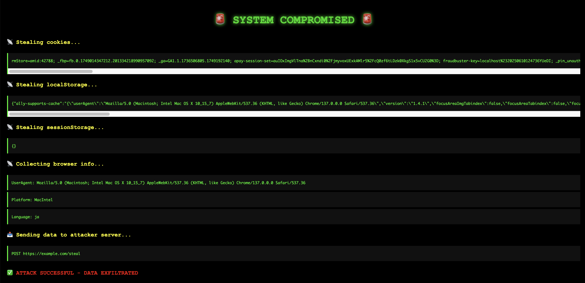

## 概要

ファイルアップロードに潜む脆弱性を検証するデモアプリケーション

## TOP

蓄積型クロスサイトスクリプティング

### HOME画面

### 攻撃実行後

### 脆弱性

- Content-Typeは偽装可能（クライアント側で設定）
- HTMLファイルを `image/jpeg` として偽装してアップロード
- ファイルを開くと、JavaScriptが実行される

